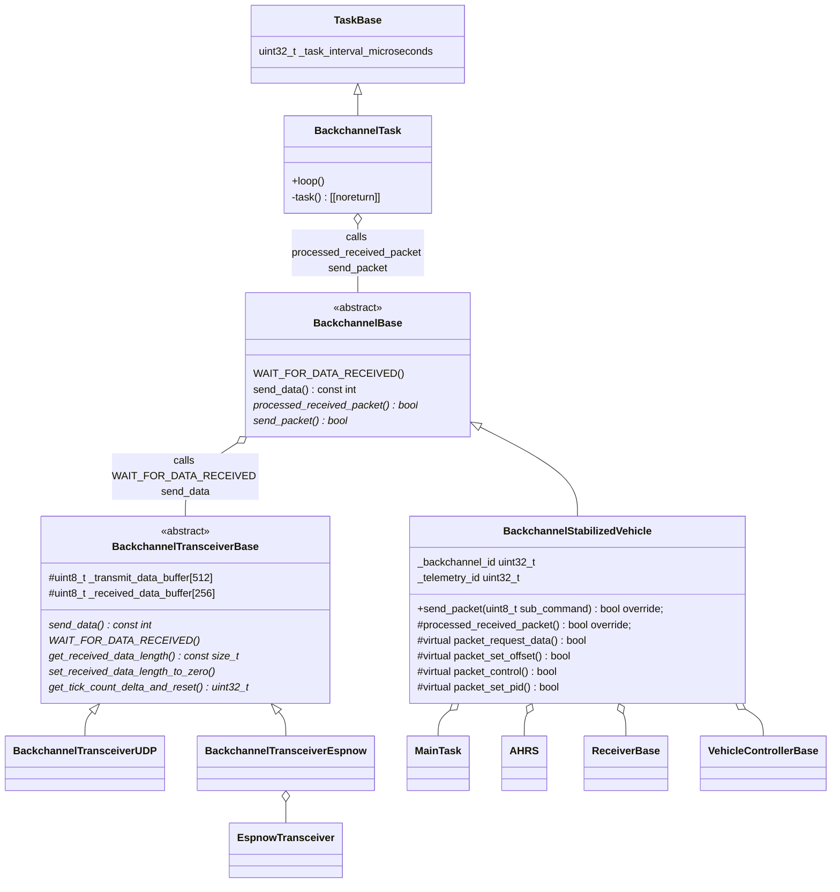

# Backchannel Library  

This library contains a number of classes that can be the basis for a Backchannel.

## Backchannel Class Structure

```mermaid
classDiagram
    class BackchannelTransceiverBase {
        <<abstract>>
        send_data() const int *
        WAIT_FOR_DATA_RECEIVED() *
        get_received_data_length() const size_t *
        set_received_data_length_to_zero() *
        get_tick_count_delta_and_reset() uint32_t *
        #uint8_t _transmit_data_buffer[512]
        #uint8_t _received_data_buffer[256]
    }

    class BackchannelBase {
        <<abstract>>
        WAIT_FOR_DATA_RECEIVED()
        send_data() const int
        processed_received_packet() bool *
        send_packet() bool *
    }
    BackchannelBase o-- BackchannelTransceiverBase : calls WAIT_FOR_DATA_RECEIVED send_data

    BackchannelTransceiverBase <|-- BackchannelTransceiverUDP

    BackchannelTransceiverBase <|-- BackchannelTransceiverEspnow
    BackchannelTransceiverEspnow o-- EspnowTransceiver

    BackchannelBase <|-- BackchannelStabilizedVehicle
    class BackchannelStabilizedVehicle {
        _backchannel_id uint32_t
        _telemetry_id uint32_t
        +send_packet(uint8_t sub_command) bool override;
        #processed_received_packet() bool override;
        #virtual packet_request_data() bool
        #virtual packet_set_offset() bool
        #virtual packet_control() bool
        #virtual packet_set_pid() bool
    }
    BackchannelStabilizedVehicle o-- MainTask
    BackchannelStabilizedVehicle o-- AHRS
    BackchannelStabilizedVehicle o-- ReceiverBase
    BackchannelStabilizedVehicle o-- VehicleControllerBase

    class TaskBase {
        uint32_t _task_interval_microseconds
    }
    TaskBase <|-- BackchannelTask
    class BackchannelTask {
        +loop()
        -task() [[noreturn]]
    }
    BackchannelTask o-- BackchannelBase : calls processed_received_packet send_packet
```
